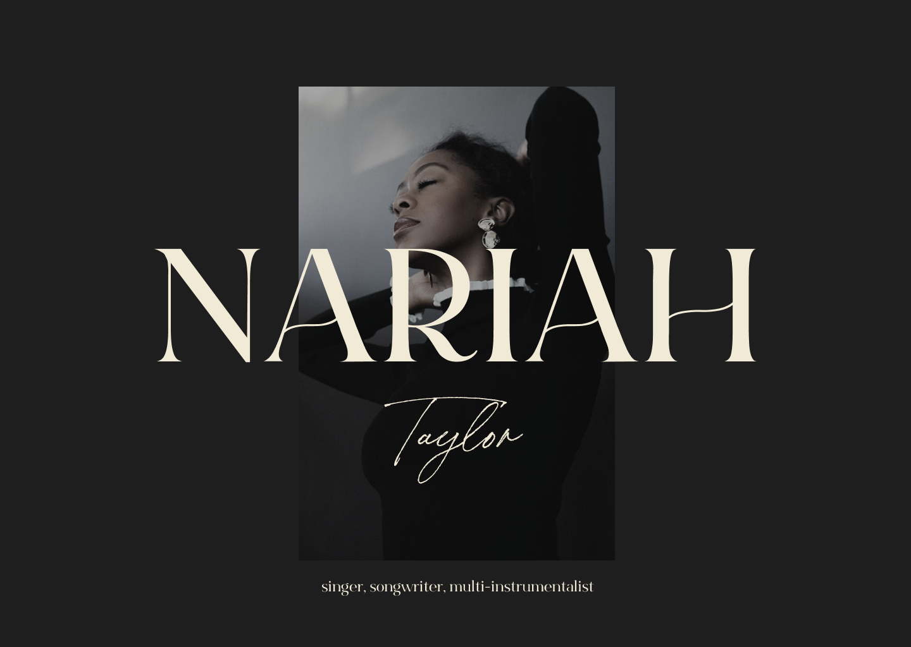

<!-- PROJECT SHIELDS -->
![Netlify Status][netlify-ci]

<!-- PROJECT LOGO -->
<br />
<div align="center" id="readme-top">
  <a href="https://github.com/dariustb/nariahtaylor">
    
  </a>

  <h1 align="center">Nariah Taylor</h1>

  <p align="center">
    Vite musician website
    <br />
    <a href="">Report Bug</a>
    ·
    <a href="">Request Feature</a>
  </p>
</div>

<!-- ABOUT THE PROJECT -->
## About The Project

### Built With
* ![Vite][vite.io]
* ![Tailwind][tailwind.css]
* ![Netlify][netlify.io]

<p align="right">(<a href="#readme-top">back to top</a>)</p>


## Usage
### With Netlify CLI
```sh
# Serve site locally
netlify dev

# Build site for production
netlify build
```

### With npm & Vite
```sh
# Serve site locally
npm run dev

# Build site for production
npm run build
```
<p align="right">(<a href="#readme-top">back to top</a>)</p>

<!-- MARKDOWN LINKS & IMAGES -->
<!-- https://www.markdownguide.org/basic-syntax/#reference-style-links -->

<!-- Main links -->
[app]:  https://nariahtaylor.com/
[docs]: https://dariustb.github.io/NariahTaylor/

<!-- Technologies -->

<!-- Featured images -->
[hero]: public/nt_hero_screenshot.png

<!-- CI Test badges -->
[netlify-ci]: https://api.netlify.com/api/v1/badges/0efbd39e-75ab-452c-aeae-a8921f9f4e8d/deploy-status

<!-- Markdown Badges -->
[node.js]:      https://img.shields.io/badge/node.js-6DA55F?style=for-the-badge&logo=node.js&logoColor=white
[npm.io]:       https://img.shields.io/badge/NPM-%23CB3837.svg?style=for-the-badge&logo=npm&logoColor=white
[vite.io]:      https://img.shields.io/badge/vite-%23646CFF.svg?style=for-the-badge&logo=vite&logoColor=white
[tailwind.css]: https://img.shields.io/badge/tailwindcss-%2338B2AC.svg?style=for-the-badge&logo=tailwind-css&logoColor=white
[netlify.io]:   https://img.shields.io/badge/netlify-%23000000.svg?style=for-the-badge&logo=netlify&logoColor=#00C7B7
